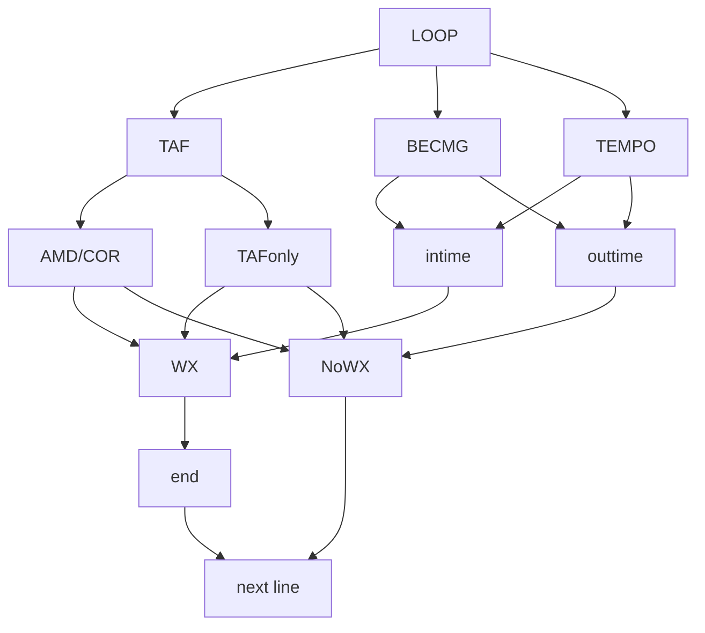

# USER GUIDE
## :memo: Where do I start?

### Step: Follow the steps below:
💡
- [X] Run the read_TAF.py at first
- [X] Choose whether crawl the data from website or not
- [X] Type in your CAA Account & Password
- [X] Result will only show the airport with WX
- NOTE: MAKE SURE YOU INSTALL THE google chrome webdriver
- Contact *r07229013@ntu.edu.tw* if you have any problems
### Process :

:rocket::rocket:
## TAF Logic flow
#This is the brief flow chart of the for loop inside the code


>Done on 15, Spetember, 2022 [name=peterpan]# This Readme is for User guide
## :rocket: User guide

```shell=
Please run the read_TAF.py at first
Choose whether crawl the data from website or not
Type in your CAA Account & Password
Result will only show the airport with WX
*NOTE: MAKE SURE YOU INSTALL THE google chrome webdriver
*NOTE: Contain **r07229013@ntu.edu.tw** if you have any problems
```

## TAF Logic flow
```graphviz
digraph hierarchy {

                nodesep=0.5 // increases the separation between nodes
                
                node [color=Red,fontname=Courier,shape=box] //All nodes will this shape and colour
                edge [color=Blue, style=dashed] //All the lines look like this
                LOOP_start->{TAF TEMPO BECMG}
                TAF->{AMDorCOR TAFonly}
                AMDorCOR->{WX NoWX}
                WX->END->Nextline
                NoWX->Nextline
                Nextline->LOOP_start
                TAFonly->{WX NoWX}
                
                {TEMPO BECMG}->{INTIME OUTTIME}
                INTIME->WX
                OUTTIME->NoWX
                
                // Put them on the same level
}
