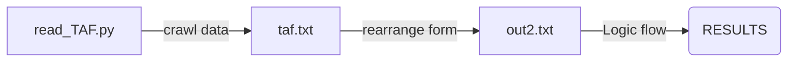
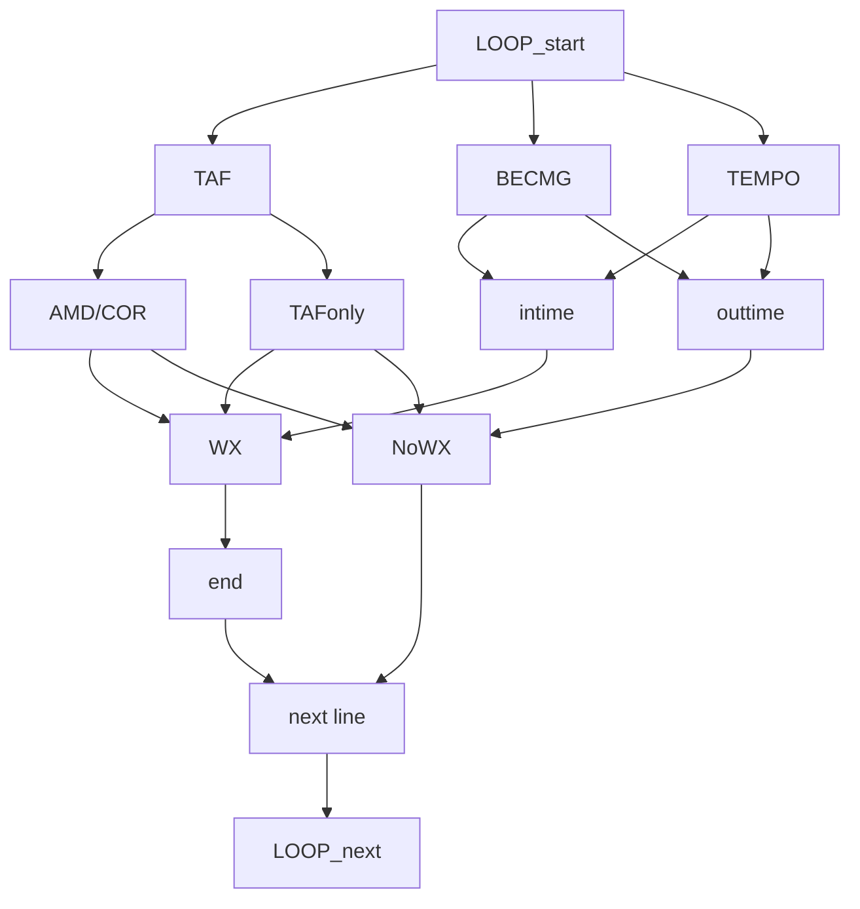

# USER GUIDE
## :memo: Where do I start?
### 此專案主要含 
1. read_TAF.py (main)
2. crawler.py (for crawling data)
3. preprocess.py (rearrange the raw data to the readable form)
### Step: Follow the steps below:
💡
- [X] Run the read_TAF.py at first
- [X] Choose whether crawl the data from website or not
- [X] Type in your CAA Account & Password
- [X] Result will only show the airport with WX
- NOTE: MAKE SURE YOU INSTALL THE google chrome webdriver
- NOTE: The path in preprocess.py is the location of your webdriver
- Please refer the following link for webdriver resource
- Crawling data is in crawler.py
[webdriver resource](https://www.youtube.com/watch?v=ximjGyZ93YQ&t=2935s)

- Contact *r07229013@ntu.edu.tw* if you have any problems
### Process :

:rocket::rocket:
## TAF Logic flow
#This is the brief flow chart of the for loop inside the code

>Done on 15, Spetember, 2022 [name=peterpan]# This Readme is for User guide
